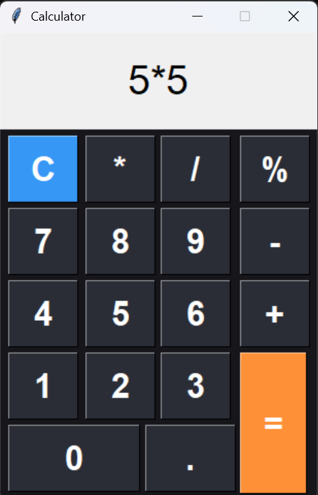

# 🧮 Calculator App (Python)

A simple desktop calculator built using **Python and Tkinter**, capable of performing basic arithmetic operations with a clean user interface.

---

## 📸 Screenshot

---

## 🚀 Features

- ➕ Addition
- ➖ Subtraction
- ✖ Multiplication
- ➗ Division
- % Modulus
- 🧹 Clear button
- ⚡ Real-time input display

---

## 🛠️ Tech Stack

- Python
- Tkinter (GUI)
